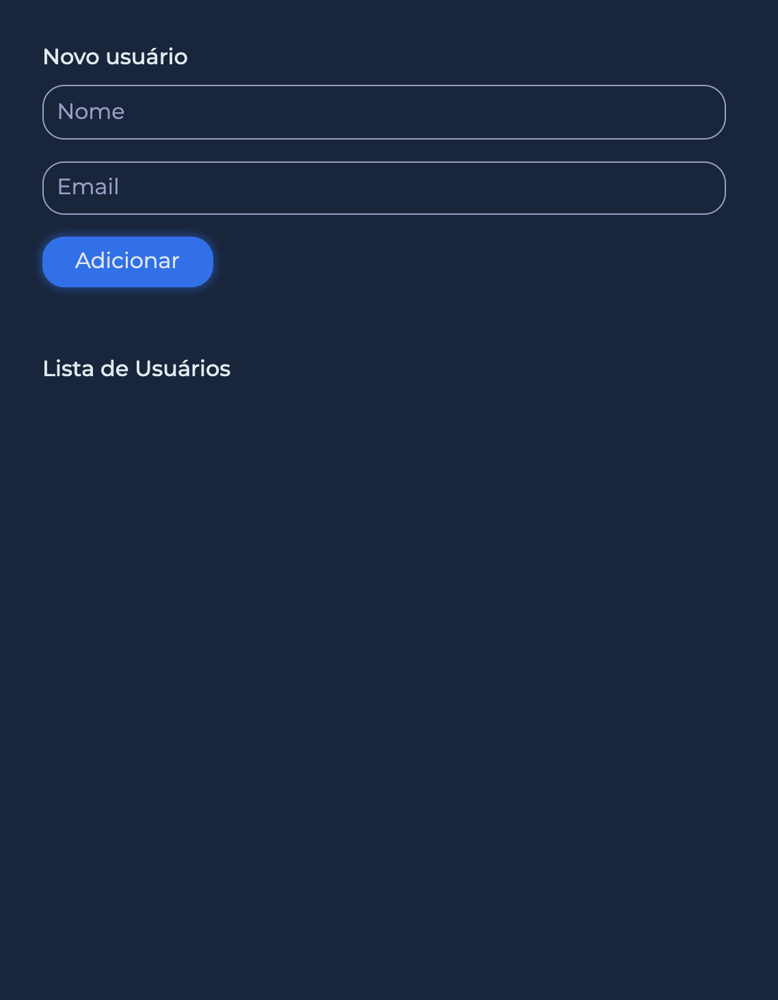

# list-client





# 💻 Começando

### Requirements

- Have this application's [API](https://github.com/jefferson-rtt/list-client-api) running

## Project setup

```
npm install
```

### Compiles and hot-reloads for development

```
npm run dev
```

### Compiles and minifies for production

```
npm build
```


### Customize configuration

See [Configuration Reference](https://cli.vuejs.org/config/).

#### made with ❤️ by [Jefferson Nunes](https://wwww.linkedin.com/in/jefferson-nunes/).